# ihsg-makro-shap 2.0

Pipeline eksperimen lanjutan: perbandingan pengaruh faktor domestik vs global
terhadap pergerakan IHSG, dengan interpretabilitas SHAP, diperluas dari
pipeline utama (`ihsg-makro-shap`, 2021-2026, 10 fitur).

> **⚠️ STATUS: Belum jadi hasil final skripsi.** Ada kontradiksi hasil RQ5
> antara pipeline ini (v2.0) dan pipeline utama (v1) yang masih menunggu
> keputusan dosen pembimbing — lihat [Catatan Penting](#-catatan-penting--kontradiksi-rq5-v1-vs-v20)
> di bawah sebelum memakai angka apapun dari repo ini di naskah final.

## Struktur folder

```
src/                        skrip pipeline, urut sesuai nomor nama file
data_raw/                    data mentah per sumber
data_processed/              dataset_final.csv gabungan
outputs/figures/             semua .png
outputs/tables/              semua .csv hasil (SHAP, ablation, uji statistik, dst)
outputs/models/               model tersimpan (.joblib, .keras)
```

## Cara menjalankan

1. Clone repo, `pip install -r requirements.txt` (tambahan dari v1: `tensorflow` untuk LSTM)
2. Copy `config_template.py` → `config.py`, isi `FRED_API_KEY`
3. Unduh manual ke `data_raw/`: BI Rate, INDONIA, EPU (dari v1, cover periode 2018-08 dst), + **BARU**: Inflasi (YoY, BPS), PDB (per-triwulan, BPS, 1 file/tahun bernama `pdb_raw_<tahun>.csv`)
4. Jalankan skrip berurutan: `hari1_akuisisi_data.py` → `hari2_gabung_data.py` → `hari2b_fitur_turunan.py` → `hari3_eda.py` → `hari3b_ols_wald.py` → `hari3c_modeling.py` → `hari4_shap_v2.py` → `hari6_arimax.py` → `hari7_lstm.py` (LSTM disarankan lewat Google Colab kalau `pip install tensorflow` gagal di lokal)

## Dataset

| | v1 (settled) | v2.0 (repo ini) |
|---|---|---|
| Periode | 2021-01-04 s/d 2026-06-29 | **2019-09-02 s/d 2026-06-29** |
| Observasi | 1.316 | **1.642** |
| Fitur | 10 (3 domestik + 7 global) | **17** (5 domestik + 7 global + **5 teknikal baru**) |
| Episode krisis | 2 (Mar-Apr 2025, Jan-Mei 2026) | **3** (+COVID Feb-Apr 2020) |

**Fitur baru v2.0**: Inflasi YoY, PDB YoY (domestik) + momentum return 1-3 hari, volatilitas bergulir 5 & 20 hari (teknikal). CCI/IKK dipertimbangkan tapi **dibatalkan** (akses cuma lewat PDF bulanan BI, biaya akuisisi tidak sepadan manfaatnya).

---

## Hasil Per Fase

### EDA
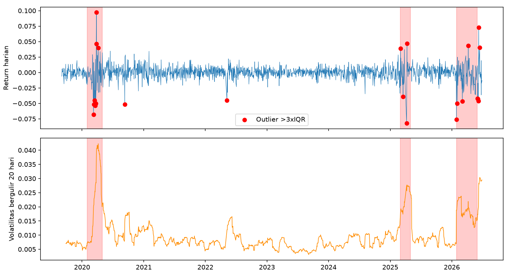
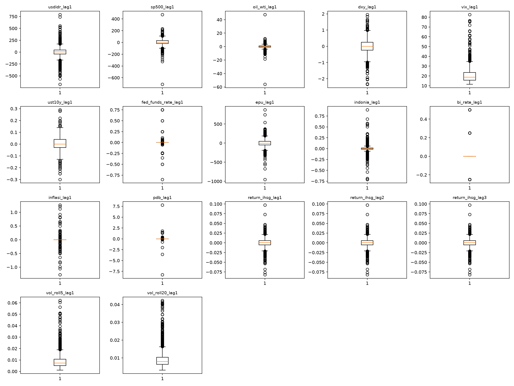
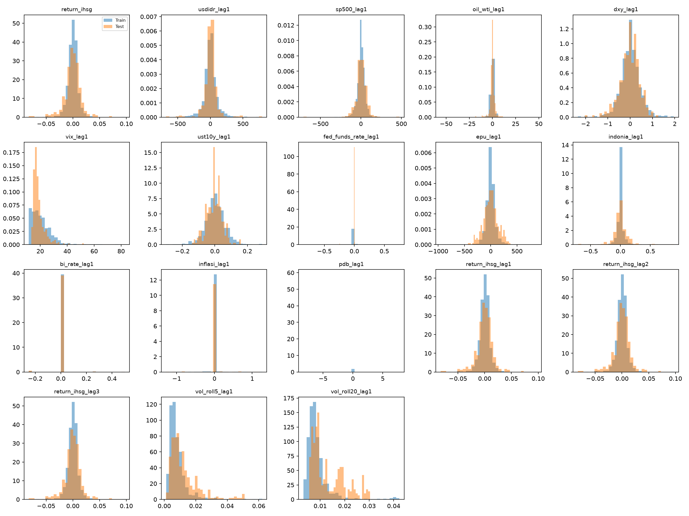

24 outlier ekstrem terdeteksi (>3×IQR): 11 di train, 13 di test — naik dari 15 (v1) karena periode sekarang mencakup crash COVID Maret 2020.

### OLS + Wald Test (RQ1-3)
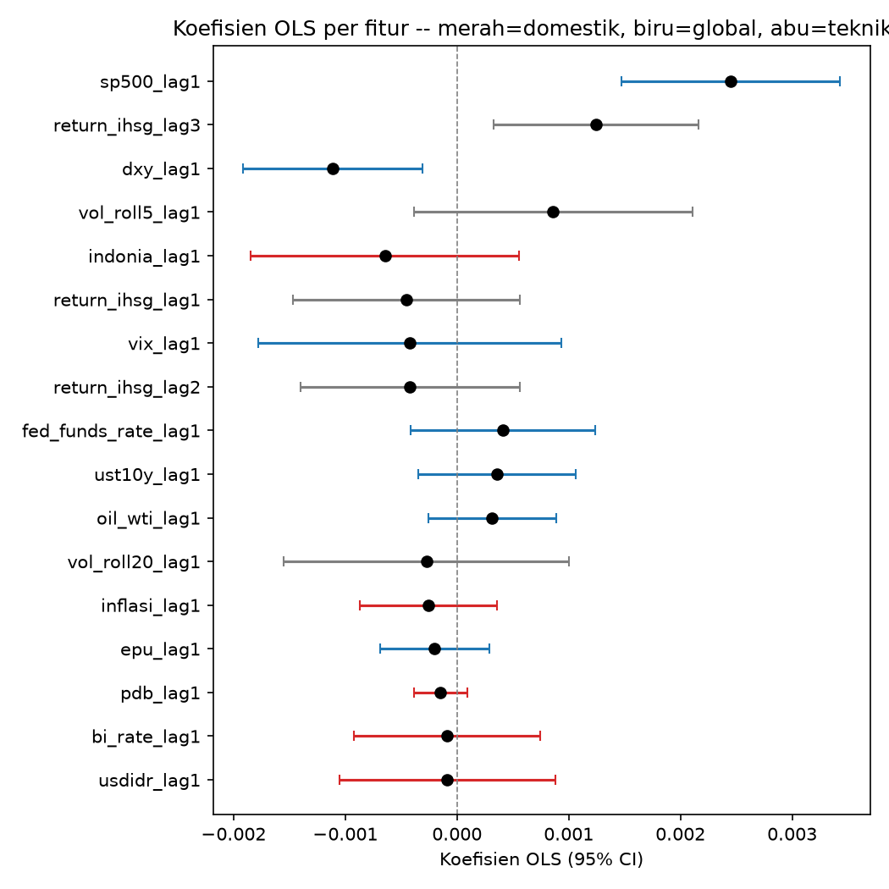

| RQ | v1 (10 fitur) | v2.0 (17 fitur) |
|---|---|---|
| RQ1 — domestik signifikan? | p=0,599 (tidak) | p=0,641 (tidak) |
| RQ2 — global signifikan? | p=3,3×10⁻¹⁰ (ya) | p=0,0000 (ya) |
| RQ3 — beda domestik-global? | p=0,115 (tidak) | p=0,0511 (tidak, tapi dekat ambang) |

R²=0,087 (naik dari 0,064 di v1). S&P 500 dan DXY tetap fitur paling dominan. VIF semua <2,5 (aman dari multikolinearitas).

### Model Prediktif (Fase 7)
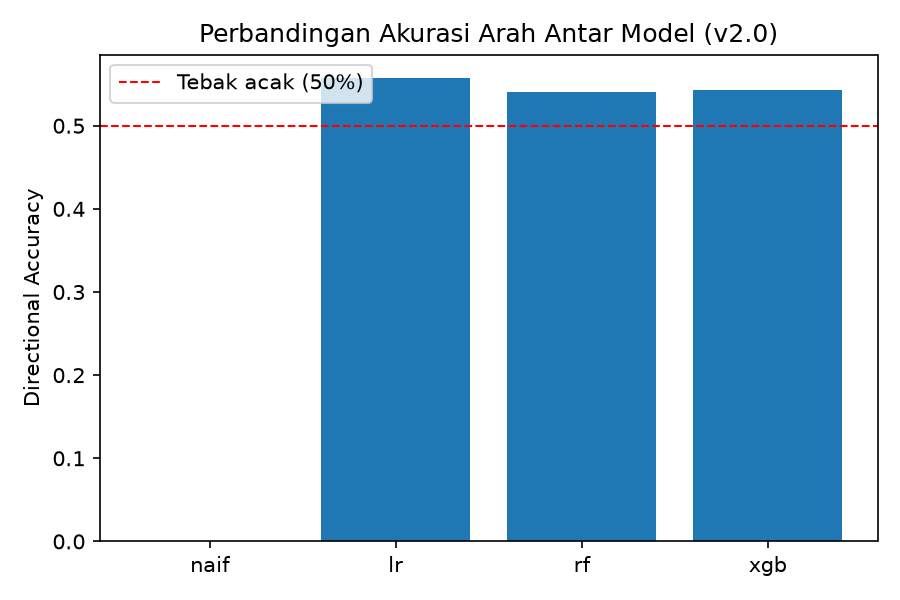
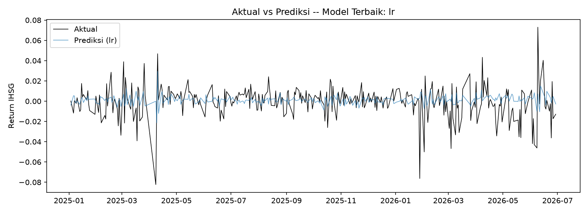
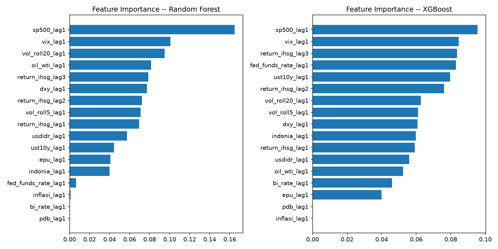

| Model | Directional Accuracy | RMSE |
|---|---|---|
| Naif | 0,0% | 0,0155 |
| Linear Regression | **55,8%** | 0,0151 |
| Random Forest | 54,0% | 0,0153 |
| XGBoost | 54,3% | 0,0152 |

Catatan: LR mengungguli RF/XGBoost di v2.0 — beda dari pola v1 (RF menang 57,6%), kemungkinan model pohon lebih rentan overfit dengan 17 fitur.

### SHAP + Rolling Window (RQ4)
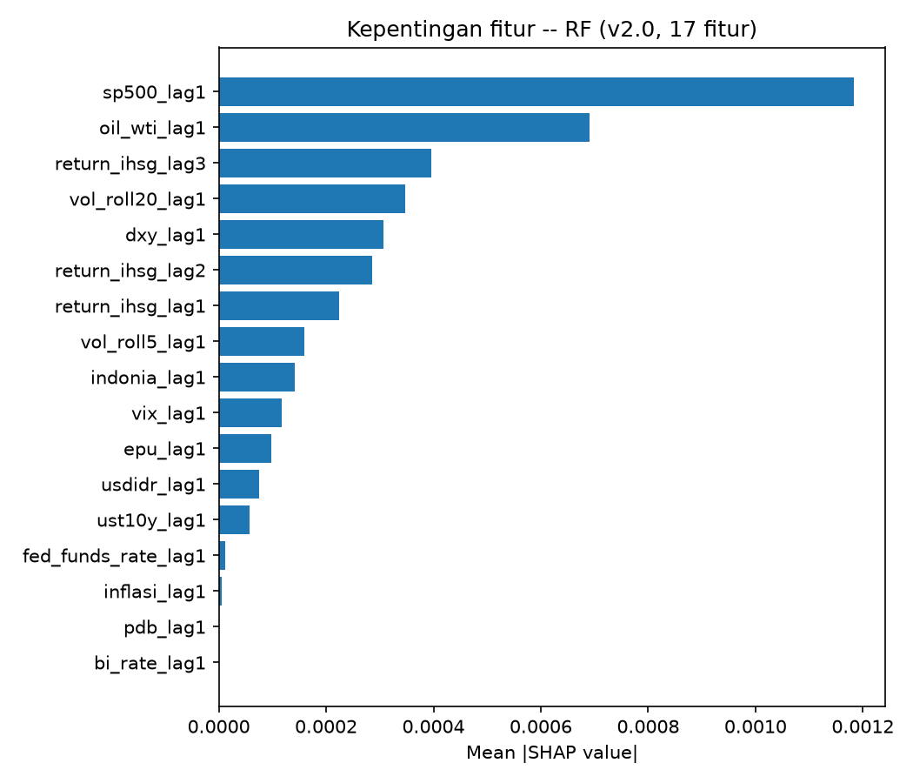
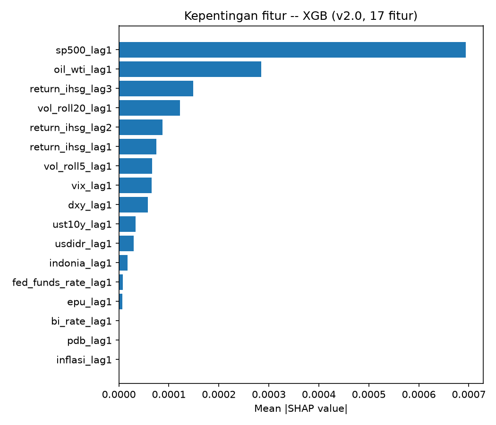
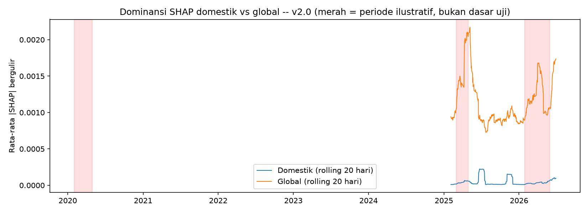

Top fitur konsisten di 3 model: `sp500_lag1`, `return_ihsg_lag3`, `vol_roll20_lag1`, `dxy_lag1`, `oil_wti_lag1`. Fitur turunan (momentum, volatilitas) terbukti berkontribusi nyata, bukan cuma lolos OLS individual.

### Ablation Study (RQ4, cross-check)
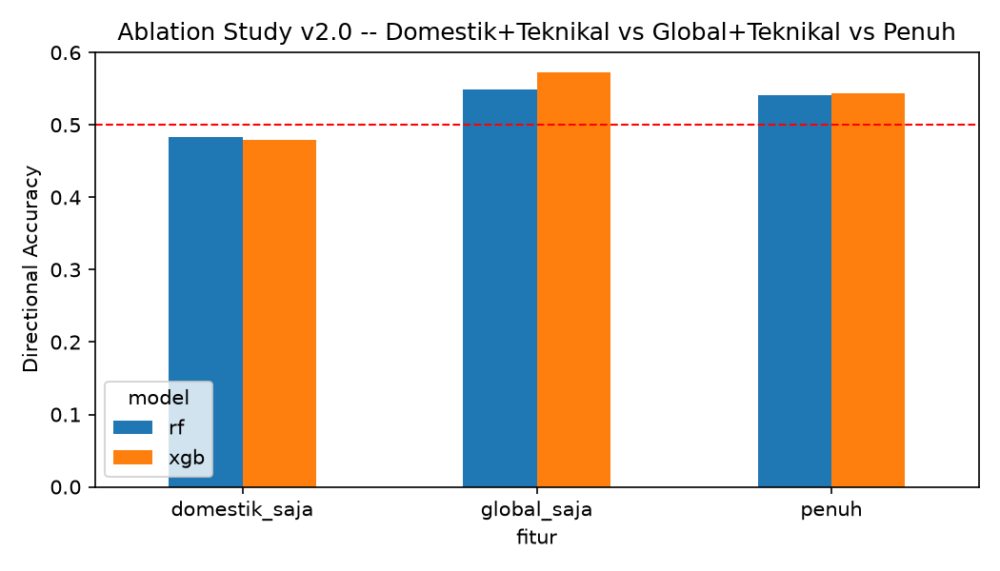

| Skenario fitur | RF | XGBoost |
|---|---|---|
| Domestik + teknikal | 48,3% | 47,9% (**di bawah tebak acak**) |
| Global + teknikal | 54,9% | **57,2%** |
| Penuh (17 fitur) | 54,0% | 54,3% |

Menambah fitur domestik ke model global-saja justru **menurunkan** performa — bukti tambahan bahwa faktor domestik (termasuk inflasi & PDB yang baru) tidak berkontribusi berarti.

### Mann-Whitney U (RQ5) — ⚠️ Lihat catatan kontradiksi di bawah
| | v1 | v2.0 |
|---|---|---|
| p-value | 0,581 | **0,0000** |
| Effect size | -0,034 | **-0,321** |
| Kesimpulan | Dominansi global **stabil** | Dominansi global **berbeda signifikan** (menguat saat volatile) |

### ARIMAX & LSTM (model time-series, arahan dosen)


| Model | Directional Accuracy | RMSE | Uji Binomial |
|---|---|---|---|
| **ARIMAX(1,0,0)** | **56,1%** | 0,01505 | p=0,014 **SIGNIFIKAN** |
| LSTM | 52,6% | 0,01711 | p=0,180 tidak signifikan |

ARIMAX adalah model dengan performa terbaik secara statistik di v2.0. LSTM tergolong lemah — sejalan dengan keterbatasan ukuran data (1.276 baris training, jauh di bawah kebutuhan tipikal deep learning).

**Ringkasan 5 model v2.0**: hanya **Linear Regression** (p=0,018) dan **ARIMAX** (p=0,014) yang signifikan beda dari tebak acak. Random Forest, XGBoost, dan LSTM tidak lolos ambang 0,05.

---

## ⚠️ Catatan Penting — Kontradiksi RQ5 (v1 vs v2.0)

Pipeline v1 (10 fitur, 2021-2026) dan v2.0 (17 fitur, 2019-2026, repo ini)
menghasilkan **kesimpulan berlawanan** untuk RQ5 (apakah dominansi global
bergeser antar rezim volatilitas):

- **v1**: tidak ada pergeseran signifikan (dominansi global stabil)
- **v2.0**: pergeseran signifikan terdeteksi (dominansi global menguat saat volatile)

Status: **belum diputuskan** dataset mana yang jadi acuan resmi skripsi.
Kemungkinan penyelesaian: (a) v1 sebagai hasil utama + v2.0 sebagai catatan
sensitivitas, (b) v2.0 jadi acuan baru dengan revisi judul/RQ5, atau (c)
kombinasi lain sesuai arahan dosen. **Jangan kutip hasil RQ5 dari repo ini
di naskah final sebelum keputusan ini diambil.**

## Keterbatasan Diketahui

- CCI/Indeks Keyakinan Konsumen tidak dimasukkan (akses data sulit)
- Grid tuning RF/XGBoost di v2.0 adalah desain baru, belum tentu identik dengan grid v1
- Metode uji RQ3 (kontras linear domestik-global) adalah interpretasi ulang, belum diverifikasi identik dengan metode asli v1
- Tanggal rilis resmi Inflasi/PDB memakai offset konservatif (estimasi), bukan tanggal pasti per observasi — cukup untuk mencegah look-ahead bias, tapi presisi harian belum diverifikasi manual ke kalender resmi
